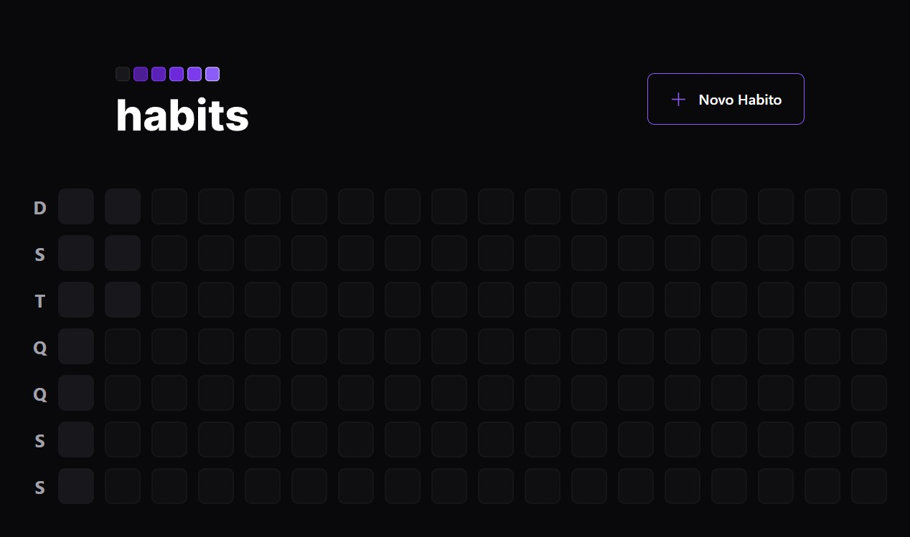
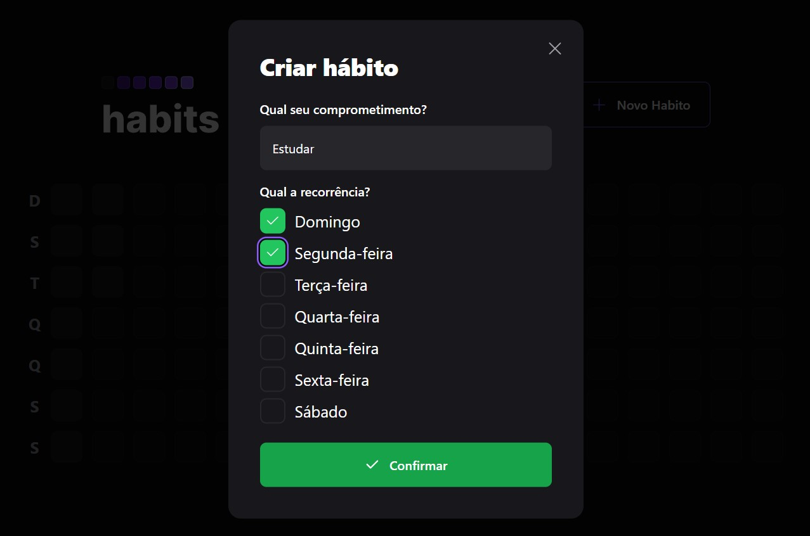
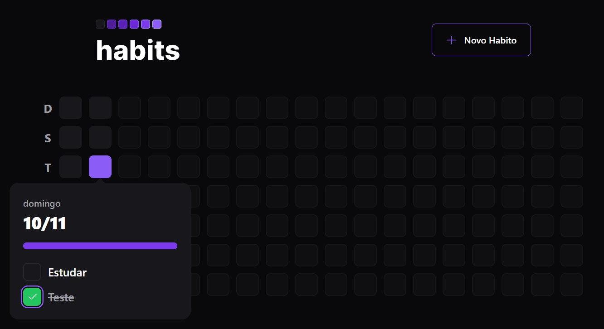

# Daily Habits


A fullstack project created on NLW event from Rocketseat, where we can create and manage daily goals. 

## :man_mechanic: Tech Languages


## :ladder: Project Features

### Create Daily Habits

You can create recurrent habits like daily goals

### Completed Daily Habits

After complete your goal on day, you can check it like completed

## :computer: Run the project

```shell
# 1. Clone the project

git clone https://github.com/NisanEduardo/rocketseat-nlw-setup.git

# 2. Install server folder dependencies

npm install

# 2. Install web folder dependencies

npm install

# 3. Run migrations

npx prisma migrate dev

# 4. Start server

npm run dev

# 5. Run web project

npm run dev
```
